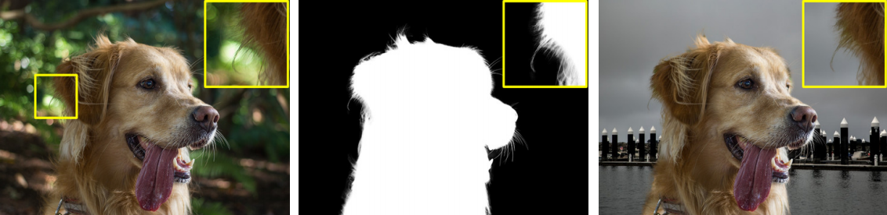

# Bakcground Remover


<p align="center">
  
</p>

## Requirements
GPU memory >= 11GB for inference on Adobe Composition-1K testing set, more generally for resolutions above 1920x1080.

#### Packages:
- torch >= 1.4
- numpy
- opencv-python
#### Additional Packages 
- matplotlib


## Prediction 
There is a script `inference.py` which gives the background subtracted from the provided image

## Citation

```
@article{forte2020fbamatting,
  title   = {BackgroundRemover},
  author  = {Inenarratus},
}
```


## Main techniques used:

* Deep Learning
* Modern Computer Vision
* Data Augmentation
* Image Segmentation

## Visualizing the data:

I used the AISegment.com Matting Human dataset, which consists of approximately 34 thousand pictures and masks of mid-upper body selfies, with only one person in each picture, relatively near from the camera and with a high contrast with the background.
